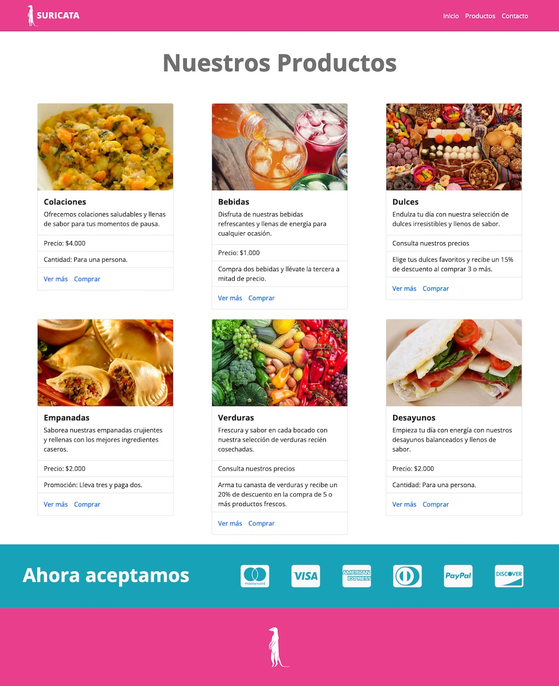
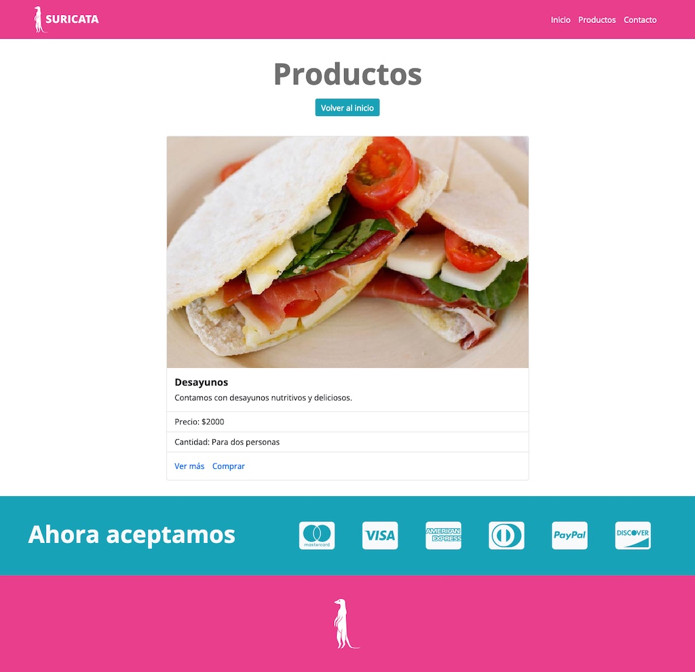
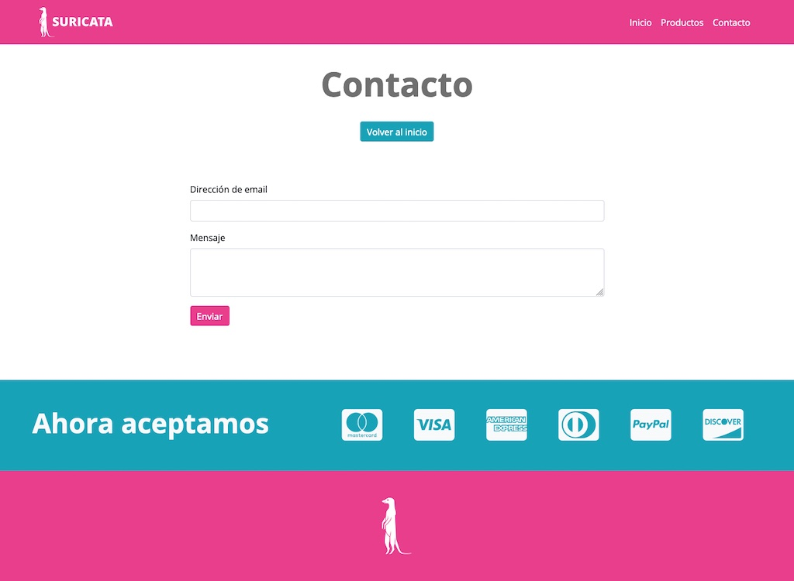

# Suricata

Este proyecto tiene como objetivo validar los conocimientos adquiridos con Vue, implementando la navegación dentro de una interfaz web. La estructura del proyecto está desarrollada con **Vue Router** para gestionar la navegación y **Bootstrap** para la estilización de los componentes. Además, se ha integrado **modern-normalize** para garantizar una base de estilos consistente entre navegadores. La compilación y despliegue del proyecto se realizaron utilizando **Vercel**, proporcionando un entorno de producción optimizado.

## Resultado Final

👉 [Presionar para ver la página ](https://desafio-suricata-encaminada.vercel.app) 👈

## Requerimientos

- Se modificó el código del menú de navegación para integrar los enlaces de navegación mediante el componente `<router-link>`, que facilita la transición entre vistas sin recargar la página.
  
- Se generaron las rutas necesarias basadas en los ítems definidos en el menú de navegación. Estas rutas cargan los componentes correspondientes utilizando **lazy load** (carga controlada), lo que optimiza el rendimiento al cargar únicamente los recursos necesarios cuando son solicitados.

- Las vistas correspondientes a cada ruta se organizaron en un directorio específico. Esto permite que las rutas definidas no solo existan, sino que también tengan funcionalidad, mostrando la información adecuada al usuario.

- En las vistas **Productos** y **Contacto**, se incluyó un enlace de redirección que lleva de vuelta a la página de inicio, mejorando la accesibilidad y la experiencia de navegación del sitio.

- En la vista **Productos.vue**, se configuró la recepción de **props** que son enviadas desde la definición de la ruta, permitiendo pasar información de forma dinámica a esta vista.

### Páginas del requerimiento

